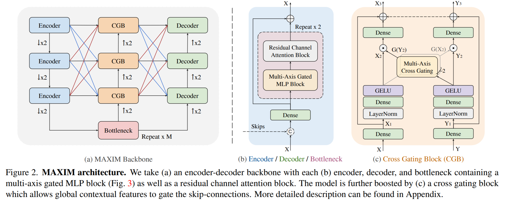

[](https://paperswithcode.com/sota/deblurring-on-hide-trained-on-gopro?p=maxim-multi-axis-mlp-for-image-processing)
[](https://paperswithcode.com/sota/deblurring-on-gopro?p=maxim-multi-axis-mlp-for-image-processing)
[](https://paperswithcode.com/sota/deblurring-on-realblur-j-1?p=maxim-multi-axis-mlp-for-image-processing)
[](https://paperswithcode.com/sota/deblurring-on-realblur-r?p=maxim-multi-axis-mlp-for-image-processing)
[](https://paperswithcode.com/sota/deblurring-on-realblur-j-trained-on-gopro?p=maxim-multi-axis-mlp-for-image-processing)
[](https://paperswithcode.com/sota/deblurring-on-realblur-r-trained-on-gopro?p=maxim-multi-axis-mlp-for-image-processing)

[](https://paperswithcode.com/sota/low-light-image-enhancement-on-lol?p=maxim-multi-axis-mlp-for-image-processing)
[](https://paperswithcode.com/sota/photo-retouching-on-mit-adobe-5k?p=maxim-multi-axis-mlp-for-image-processing)

[](https://paperswithcode.com/sota/single-image-deraining-on-rain100h?p=maxim-multi-axis-mlp-for-image-processing)
[](https://paperswithcode.com/sota/single-image-deraining-on-rain100l?p=maxim-multi-axis-mlp-for-image-processing)
[](https://paperswithcode.com/sota/single-image-deraining-on-test100?p=maxim-multi-axis-mlp-for-image-processing)
[](https://paperswithcode.com/sota/single-image-deraining-on-test2800?p=maxim-multi-axis-mlp-for-image-processing)
[](https://paperswithcode.com/sota/single-image-deraining-on-test1200?p=maxim-multi-axis-mlp-for-image-processing)

[](https://paperswithcode.com/sota/image-denoising-on-sidd?p=maxim-multi-axis-mlp-for-image-processing)
[](https://paperswithcode.com/sota/image-denoising-on-dnd?p=maxim-multi-axis-mlp-for-image-processing)

# MAXIM: Multi-Axis MLP for Image Processing (CVPR 2022 Oral, Best Paper Nomination)

[](https://arxiv.org/abs/2201.02973)
[](https://colab.research.google.com/github/google-research/maxim/blob/master/colab_inference_demo.ipynb)
[](https://docs.google.com/presentation/d/1NKT0PZrpmsCZTdgvsZztfNUJJ9Bvlr1r/edit?usp=sharing&ouid=103274492054041370194&rtpof=true&sd=true)
[](https://docs.google.com/presentation/d/1fd73qn_8Ymc5okFttQ3vzQm1SABbIeoI/edit?usp=sharing&ouid=103274492054041370194&rtpof=true&sd=true)

This repo hosts the official implementation of the MAXIM models: 

["MAXIM: Multi-Axis MLP for Image Processing"](https://arxiv.org/abs/2201.02973). CVPR 2022 Oral.\
[Zhengzhong Tu](https://www.linkedin.com/in/vztu/), [Hossein Talebi](https://scholar.google.com/citations?hl=en&user=UOX9BigAAAAJ), [Han Zhang](https://sites.google.com/view/hanzhang), [Feng Yang](https://sites.google.com/view/feng-yang), [Peyman Milanfar](https://sites.google.com/view/milanfarhome/), [Alan Bovik](https://www.ece.utexas.edu/people/faculty/alan-bovik), and [Yinxiao Li](https://scholar.google.com/citations?user=kZsIU74AAAAJ&hl=en)\
Google Research, University of Texas at Austin

*Disclaimer: This is not an officially supported Google product.*

**News**:

- Jan 8, 2023: Released a pytorch implementation. Check it out here: [maxim-pytorch](https://github.com/vztu/maxim-pytorch/tree/main/maxim_pytorch).
- Oct 21, 2022: MAXIM models have been ported to TensorFlow by [@sayakpaul](https://github.com/sayakpaul). Check it out here: [maxim-tf](https://github.com/sayakpaul/maxim-tf). He also created a couple of Hugging Face Spaces to allow users to quickly try out the different models:
  * [Denoising](https://huggingface.co/spaces/sayakpaul/sidd-denoising-maxim)
  * [Low-light enhancement](https://huggingface.co/spaces/sayakpaul/lol-enhancement-maxim)
  * [Image retouching](https://huggingface.co/spaces/sayakpaul/fivek-retouching-maxim)
  * [Dehazing indoors](https://huggingface.co/spaces/sayakpaul/sots-indoor-dehazing-maxim)
  * [Dehazing outdoors](https://huggingface.co/spaces/sayakpaul/sots-outdoor-dehazing-maxim)
  * [Image deraining](https://huggingface.co/spaces/sayakpaul/rain13k-deraining-maxim)
  * [Image deblurring](https://huggingface.co/spaces/sayakpaul/gopro-deblurring-maxim)
- Sep 8, 2022: our Google AI blog covering both [MaxViT](https://arxiv.org/abs/2204.01697) and [MAXIM](https://github.com/google-research/maxim) is [live](https://ai.googleblog.com/2022/09/a-multi-axis-approach-for-vision.html).
- Apr 25, 2022: Added demos.
  - Colab demo by [@deshwalmahesh](https://github.com/deshwalmahesh) [](https://colab.research.google.com/github/google-research/maxim/blob/master/colab_inference_demo.ipynb)
  - Replicate web demo [](https://replicate.com/google-research/maxim).
- Jun 22, 2022: MAXIM selected as 1 of the best paper nomination!
- Mar 29, 2022: MAXIM selected for an oral presentation at CVPR 2022!
- Mar 28, 2022: initial push to Github.
- Mar 3, 2022: paper accepted to CVPR 2022!
- Jan 9, 2022: initial uploads to [Arxiv](https://arxiv.org/abs/2201.02973)

## Quick Demos
Try the web demo for Image Denoising, Deblurring, Deraining, Dehazing and Enhancement with customized input image here [](https://replicate.com/google-research/maxim)

Try the Colab here using [](https://colab.research.google.com/github/google-research/maxim/blob/master/colab_inference_demo.ipynb)


## Architecture



## Installation

Install dependencies:

```
pip install -r requirements.txt
```

Setup project:

```
pip install .
```

## Results and Pre-trained models

We provide the pre-trained models and visual results.
Please contact us if you have any questions or requests.

| Task | Dataset | PSNR | SSIM | Model | #params | FLOPs | ckpt | outputs |
|:---:|:---:|:---:|:---:| :---:|:---:|:---:|:---:|:---:|
| Denoising | SIDD | 39.96 | 0.960 | MAXIM-3S | 22.2M | 339G | [ckpt](https://console.cloud.google.com/storage/browser/gresearch/maxim/ckpt/Denoising/SIDD/) | [images](https://console.cloud.google.com/storage/browser/gresearch/maxim/results/Denoising/SIDD/) |
| Denoising | DND  | 39.84 | 0.954 | MAXIM-3S | 22.2M | 339G | [ckpt](https://console.cloud.google.com/storage/browser/gresearch/maxim/ckpt/Denoising/SIDD/) | [images](https://console.cloud.google.com/storage/browser/gresearch/maxim/results/Denoising/DND/) |
| Deblurring | GoPro | 32.86 | 0.961 | MAXIM-3S | 22.2M | 339G | [ckpt](https://console.cloud.google.com/storage/browser/gresearch/maxim/ckpt/Deblurring/GoPro) | [images](https://console.cloud.google.com/storage/browser/gresearch/maxim/results/Deblurring/GoPro/) |
| Deblurring | HIDE  | 32.83 | 0.956 | MAXIM-3S | 22.2M | 339G | [ckpt](https://console.cloud.google.com/storage/browser/gresearch/maxim/ckpt/Deblurring/GoPro) | images <!--(https://console.cloud.google.com/storage/browser/gresearch/maxim/results/Deblurring/GoPro/)--> |
| Deblurring | REDS  | 28.93 | 0.865 | MAXIM-3S | 22.2M | 339G | [ckpt](https://console.cloud.google.com/storage/browser/gresearch/maxim/ckpt/Deblurring/REDS) | images <!--(https://console.cloud.google.com/storage/browser/gresearch/maxim/results/Deblurring/REDS/)--> |
| Deblurring | RealBlur-R | 39.45 | 0.962 | MAXIM-3S | 22.2M | 339G | [ckpt](https://console.cloud.google.com/storage/browser/gresearch/maxim/ckpt/Deblurring/RealBlur_R) | [images](https://console.cloud.google.com/storage/browser/gresearch/maxim/results/Deblurring/RealBlur/) |
| Deblurring | RealBlur-J | 32.84 | 0.935 | MAXIM-3S | 22.2M | 339G | [ckpt](https://console.cloud.google.com/storage/browser/gresearch/maxim/ckpt/Deblurring/RealBlur_J) | [images](https://console.cloud.google.com/storage/browser/gresearch/maxim/results/Deblurring/RealBlur/) |
| Deraining | Rain13k | 33.24 | 0.933 | MAXIM-2S | 14.1M | 216G | [ckpt](https://console.cloud.google.com/storage/browser/gresearch/maxim/ckpt/Deraining/Rain13k) | [images](https://console.cloud.google.com/storage/browser/gresearch/maxim/results/Deraining/Rain13k/) |
| Deraining | Raindrop | 31.87 | 0.935 | MAXIM-2S | 14.1M | 216G | [ckpt](https://console.cloud.google.com/storage/browser/gresearch/maxim/ckpt/Deraining/Raindrop) | [images](https://console.cloud.google.com/storage/browser/gresearch/maxim/results/Deraining/Raindrop/) |
| Dehazing | RESIDE-Indoor | 38.11 | 0.991 | MAXIM-2S | 14.1M | 216G | [ckpt](https://console.cloud.google.com/storage/browser/gresearch/maxim/ckpt/Dehazing/SOTS-Indoor) | [images](https://console.cloud.google.com/storage/browser/gresearch/maxim/results/Dehazing/RESIDE-Indoor/) |
| Dehazing | RESIDE-Outdoor | 34.19 | 0.985 | MAXIM-2S | 14.1M | 216G | [ckpt](https://console.cloud.google.com/storage/browser/gresearch/maxim/ckpt/Dehazing/SOTS-Outdoor) | [images](https://console.cloud.google.com/storage/browser/gresearch/maxim/results/Dehazing/RESIDE-Outdoor/) |
| Enhancement | LOL | 23.43 | 0.863 | MAXIM-2S | 14.1M | 216G | [ckpt](https://console.cloud.google.com/storage/browser/gresearch/maxim/ckpt/Enhancement/LOL) | [images](https://console.cloud.google.com/storage/browser/gresearch/maxim/results/Enhancement/LOL/) |
| Enhancement | FiveK | 26.15 | 0.945 | MAXIM-2S | 14.1M  |  216G | [ckpt](https://console.cloud.google.com/storage/browser/gresearch/maxim/ckpt/Enhancement/FiveK) | [images](https://console.cloud.google.com/storage/browser/gresearch/maxim/results/Enhancement/FiveK/) |

<!-- You can also download most of the training and test datasets we used on [gcloud](https://console.cloud.google.com/storage/browser/gresearch/maxim/datasets/). -->

## Demo

First download corresponding checkpoints and then go ahead and run:

<details>
  <summary><strong>Image Denoising</strong> (click to expand) </summary>

```
python3 maxim/run_eval.py --task Denoising --ckpt_path ${SIDD_CKPT_PATH} \
  --input_dir maxim/images/Denoising --output_dir maxim/images/Results --has_target=False
```
</details>

<details>
  <summary><strong>Image Deblurring</strong> (click to expand) </summary>

```
python3 maxim/run_eval.py --task Deblurring --ckpt_path ${GOPRO_CKPT_PATH} \
  --input_dir maxim/images/Deblurring --output_dir maxim/images/Results --has_target=False
```
</details>

<details>
  <summary><strong>Image Deraining</strong> (click to expand) </summary>

Rain streak:
```
python3 maxim/run_eval.py --task Deraining --ckpt_path ${RAIN13K_CKPT_PATH} \
  --input_dir maxim/images/Deraining --output_dir maxim/images/Results --has_target=False
```

Rain drop:
```
python3 maxim/run_eval.py --task Deraining --ckpt_path ${RAINDROP_CKPT_PATH} \
  --input_dir maxim/images/Deraining --output_dir maxim/images/Results --has_target=False
```
</details>

<details>
  <summary><strong>Image Dehazing</strong> (click to expand) </summary>

Indoor:
```
python3 maxim/run_eval.py --task Dehazing --ckpt_path ${REDISE_INDOOR_CKPT_PATH} \
  --input_dir maxim/images/Dehazing --output_dir maxim/images/Results --has_target=False
```

Outdoor:
```
python3 maxim/run_eval.py --task Dehazing --ckpt_path ${REDISE_OUTDOOR_CKPT_PATH} \
  --input_dir maxim/images/Dehazing --output_dir maxim/images/Results --has_target=False
```
</details>

<details>
  <summary><strong>Image Enhancement</strong> (click to expand) </summary>

Low-light enhancement:
```
python3 maxim/run_eval.py --task Enhancement --ckpt_path ${LOL_CKPT_PATH} \
  --input_dir maxim/images/Enhancement --output_dir maxim/images/Results --has_target=False
```

Retouching:
```
python3 maxim/run_eval.py --task Enhancement --ckpt_path ${FIVEK_CKPT_PATH} \
  --input_dir maxim/images/Enhancement --output_dir maxim/images/Results --has_target=False
```
</details>

## Results

<details>
  <summary><strong>Image Denoising</strong> (click to expand) </summary>


</details>

<details>
<summary><strong>Image Deblurring</strong> (click to expand) </summary>

<table>
  <tr>
    <td>  </td>
    <td>  </td>
  </tr>
  <tr>
    <td><p align="center"><b>Synthetic blur</b></p></td>
    <td><p align="center"><b>Realistic blur</b></p></td>
  </tr>
</table>
</details>

<details>
<summary><strong>Image Deraining</strong> (click to expand) </summary>

<table>
  <tr>
    <td>  </td>
    <td> <p align="top">  </td>
  </tr>
  <tr>
    <td><p align="center"><b>Rain streak</b></p></td>
    <td><p align="center"><b>Rain drop</b></p></td>
  </tr>
</table>
</details>

<details>
<summary><strong>Image Dehazing</strong> (click to expand) </summary>


</details>

<details>
<summary><strong>Image Enhancement</strong> (click to expand) </summary>


</details>

## Citation
Should you find this repository useful, please consider citing:
```
@article{tu2022maxim,
  title={MAXIM: Multi-Axis MLP for Image Processing},
  author={Tu, Zhengzhong and Talebi, Hossein and Zhang, Han and Yang, Feng and Milanfar, Peyman and Bovik, Alan and Li, Yinxiao},
  journal={CVPR},
  year={2022},
}
```

## Acknowledgement

This repository is built on the [vision_transformer](https://github.com/google-research/vision_transformer) and [musiq](https://github.com/google-research/google-research/tree/master/musiq) repositories. Our work is also inspired by [HiT](https://github.com/google-research/hit-gan), [MPRNet](https://github.com/swz30/MPRNet), and [HINet](https://github.com/megvii-model/HINet).
